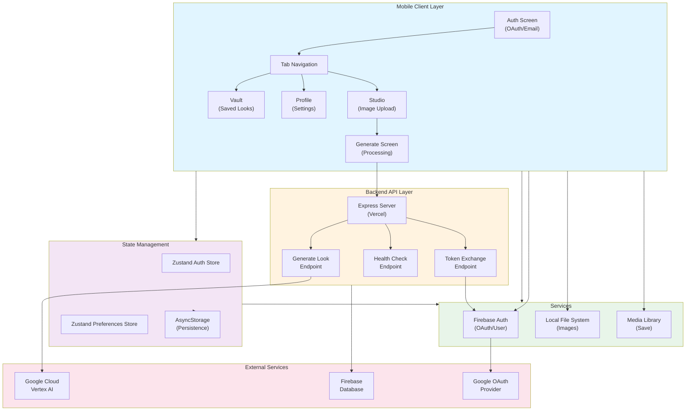
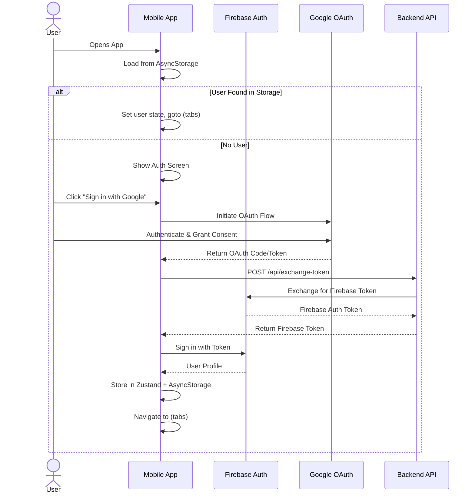
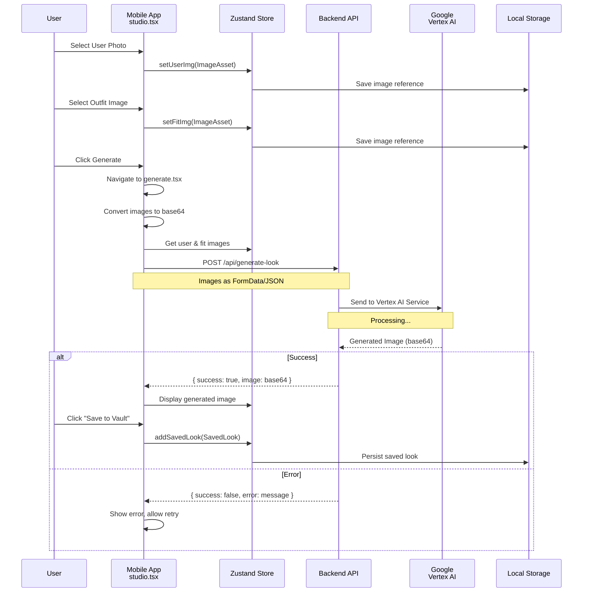
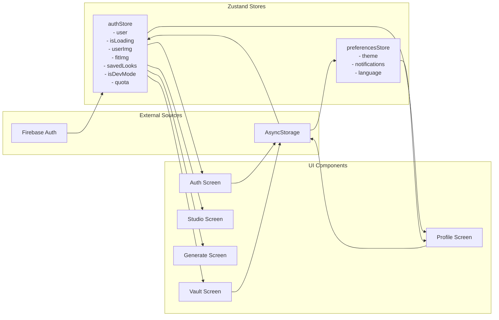
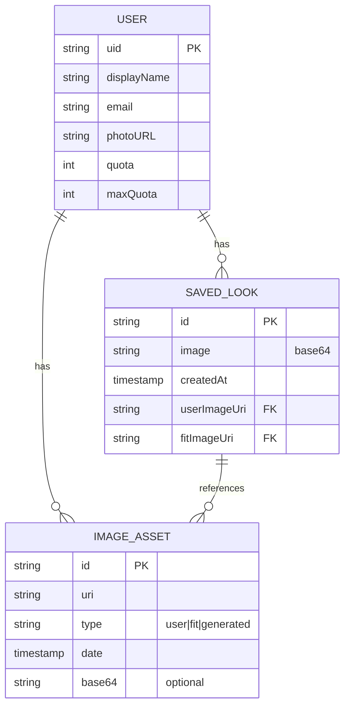
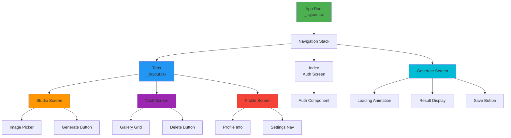

# Architecture Diagrams

## System Architecture Diagram

## Authentication Flow

## Image Generation Flow

## State Management Architecture

## Data Model Relationships

## Component Hierarchy

