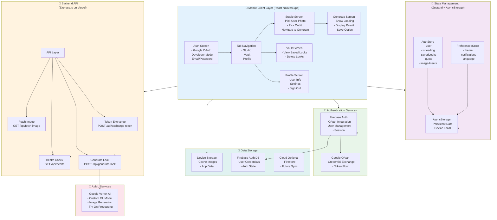
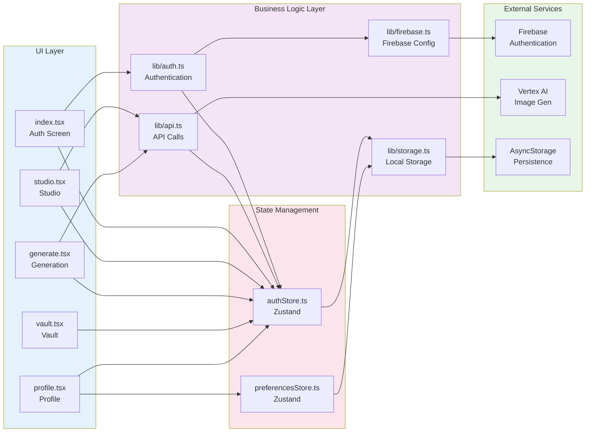
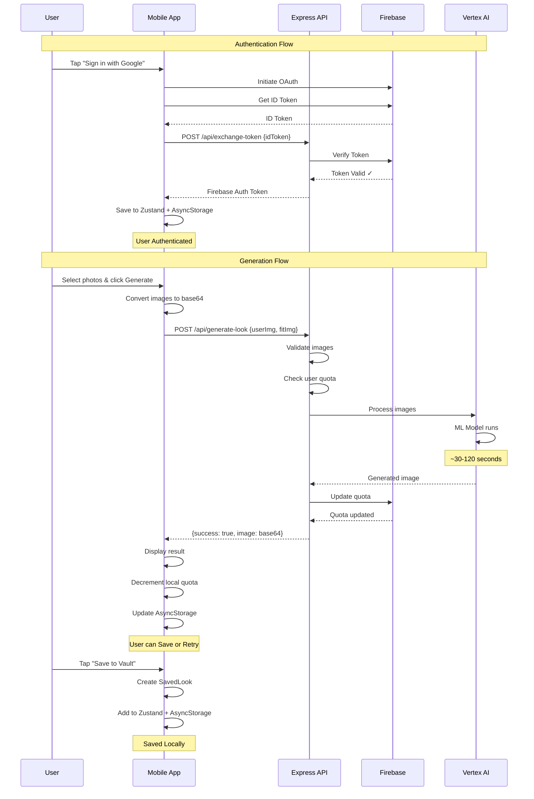
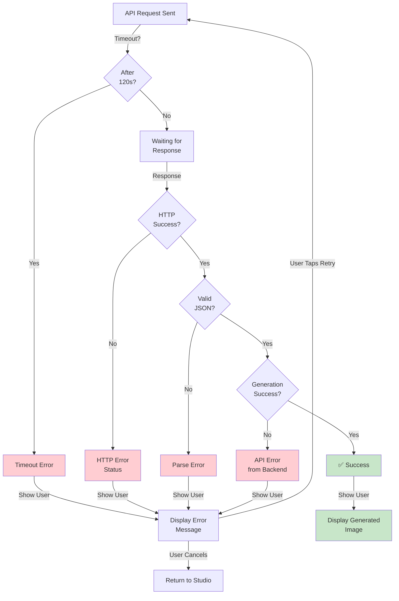
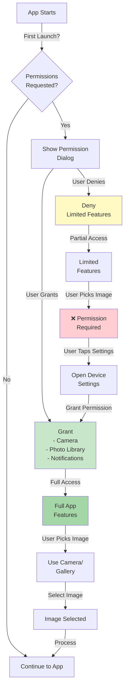
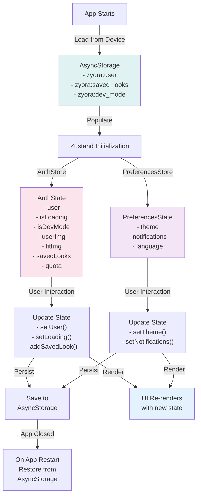
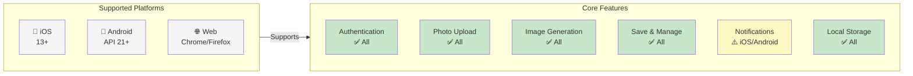

# High-Level System Architecture Diagram

## Main System Architecture

---

## Complete Data Flow

```mermaid
graph TD
    User["👤 User"]
    
    User -->|Opens App| StartApp["App Initialization"]
    StartApp -->|Check AsyncStorage| CheckAuth{"User<br/>Authenticated?"}
    
    CheckAuth -->|Yes| LoadUser["Load User Profile<br/>from Storage"]
    LoadUser -->|Set Zustand| ShowTabs["Show Tab Navigation"]
    
    CheckAuth -->|No| ShowAuth["Show Auth Screen"]
    ShowAuth -->|Tap 'Sign in Google'| GoogleFlow["🔵 Google OAuth Flow"]
    
    GoogleFlow -->|1. Open OAuth| GoogleScreen["Google Login Screen"]
    GoogleScreen -->|2. User Authenticates| GoogleAuth["Google Verifies"]
    GoogleAuth -->|3. Return Auth Code| AppReceive["App Receives Code"]
    AppReceive -->|4. Exchange for Token| BackendToken["Backend Exchange Token"]
    BackendToken -->|5. Firebase Sign-In| FirebaseSignIn["Firebase Auth"]
    FirebaseSignIn -->|6. User Created| UserProfile["UserProfile Object"]
    UserProfile -->|7. Store Locally| StoreData["Save to<br/>Zustand + AsyncStorage"]
    StoreData -->|8. Navigate| ShowTabs
    
    ShowTabs -->|User Opens Studio| StudioScreen["Studio Screen"]
    StudioScreen -->|Pick User Photo| UserPhoto["ImageAsset<br/>type: user"]
    StudioScreen -->|Pick Outfit| OutfitPhoto["ImageAsset<br/>type: fit"]
    UserPhoto -->|Store in Zustand| InMemory["In-Memory State"]
    OutfitPhoto -->|Store in Zustand| InMemory
    
    InMemory -->|Click Generate| Navigate["Navigate to<br/>Generate Screen"]
    Navigate -->|Convert to Base64| B64Conv["Base64 Conversion"]
    B64Conv -->|FormData| CreateReq["Create Request<br/>with Images"]
    CreateReq -->|POST /api/generate-look| SendAPI["Send to Backend"]
    
    SendAPI -->|Backend Receives| ValidateReq["Validate Request<br/>- Image format<br/>- Image size<br/>- User quota"]
    ValidateReq -->|Pass Validation| SendVertex["Send to<br/>Vertex AI"]
    ValidateReq -->|Fail| ReturnError["Return Error"]
    
    SendVertex -->|Processing| MLProcess["ML Model<br/>Generates Image"]
    MLProcess -->|Base64 Result| APIReturn["Return Generation<br/>Result"]
    
    ReturnError -->|Display Error| ShowError["Show Error<br/>to User"]
    ShowError -->|User Retries| CreateReq
    
    APIReturn -->|Success| DisplayGen["Display Generated<br/>Image"]
    DisplayGen -->|User Taps Save| CreateLook["Create SavedLook<br/>Object"]
    CreateLook -->|Add to Store| SaveVault["Add to<br/>Zustand + AsyncStorage"]
    SaveVault -->|Show Vault| VaultNav["Navigate to Vault"]
    
    DisplayGen -->|User Taps Generate Again| StudioScreen
    
    VaultNav -->|View Saved| VaultScreen["Vault Screen"]
    VaultScreen -->|List Looks| DisplayLooks["Display Gallery<br/>of Saved Looks"]
    DisplayLooks -->|User Deletes| RemoveLook["Remove from Store<br/>and Storage"]
    
    ShowTabs -->|User Opens Profile| ProfileScreen["Profile Screen"]
    ProfileScreen -->|Display Info| ShowInfo["Show User Info<br/>- Name<br/>- Email<br/>- Photo<br/>- Quota"]
    ShowInfo -->|User Signs Out| SignOut["Clear Data<br/>- Zustand<br/>- AsyncStorage<br/>- Firebase Session"]
    SignOut -->|Return to Auth| ShowAuth
    
    style User fill:#FFF9C4
    style GoogleFlow fill:#BBDEFB
    style MLProcess fill:#F8BBD0
    style DisplayGen fill:#C8E6C9
    style VaultScreen fill:#D1C4E9
    style ProfileScreen fill:#FFE0B2
```

---

## Component Interaction Diagram

---

## Network Request Sequence

---

## Error Handling Flow

---

## Permission Flow

---

## State Management Diagram

---

## Platform Support Matrix

